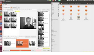
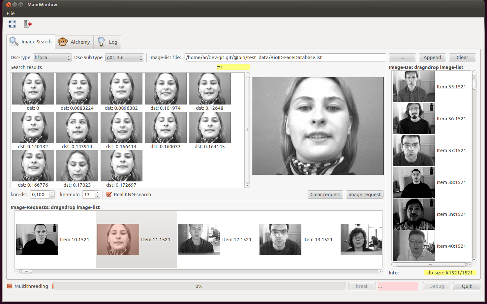

# GUI_CBIR_Search

Demo Qt-Gui [CBIR](https://en.wikipedia.org/wiki/Content-based_image_retrieval) Search

Include:
- GUI
- FPCA Descriptor
- Coo-Matrix Descriptor
- Dummy MeanCh Descriptor
- [MVP-Tree](https://en.wikipedia.org/wiki/MVP_tree) Search (based on [mvptree-library](https://code.google.com/archive/p/mvptree-library/))
- Threaded Nearest neighbor search

You can add your own implementation of the descriptor. You need create a class inherited from class [DscPluginInterface](https://github.com/gakarak/GUI_CBIR_Search/blob/master/DSC_Plugin_Interface/dscplugininterface.h).

--
Requirements:
- Qt 5.x
- OpencvCV >2.4.x

Build & Installation:
* cd /path/to/GUI_CBIR_Search
* mkdir build
* cd build
* qmake ..
* make -j8
* make install
* cd ..
* bin/GUI_MVP_Search_v4

--

Video (in Russian):

Screenshot:

